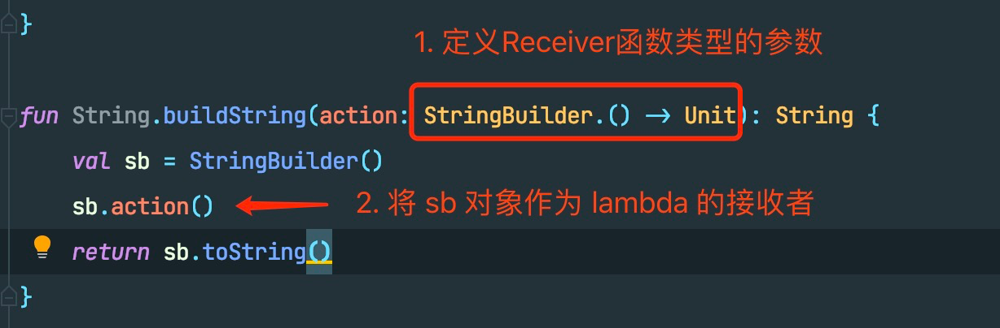
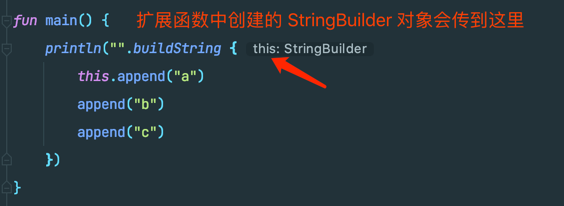
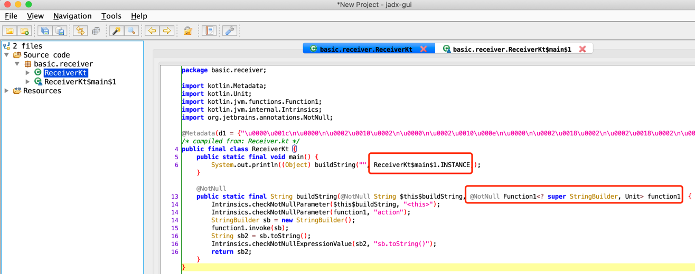
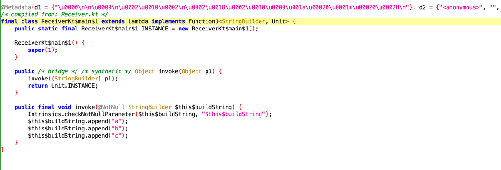
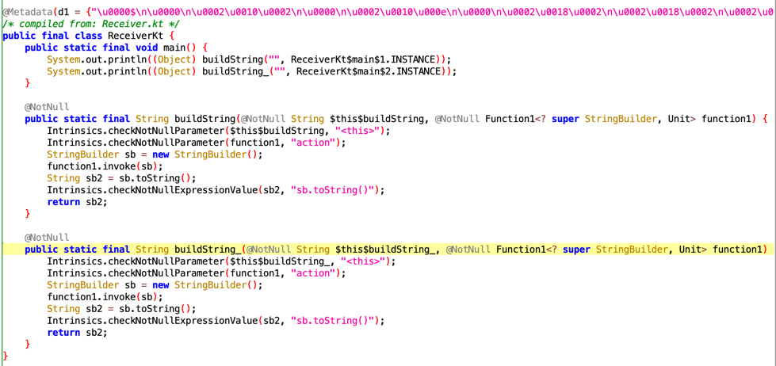
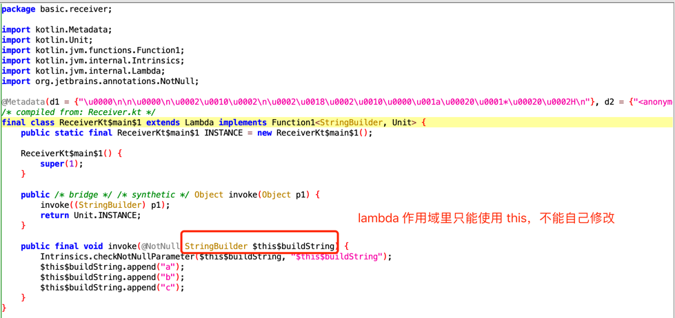
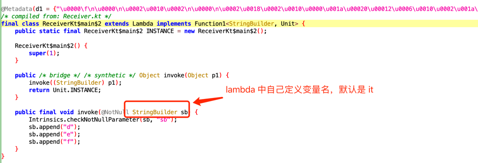

Kotlin Lambda 函数中的 Receiver 是什么？
---

### 示例代码

先来看一段示例代码，初步了解 Receiver 是什么

```kotlin
import java.lang.StringBuilder

fun main() {
    println("".buildString {
        this.append("a")
        append("b")
        append("c")
    })
}

fun String.buildString(action: StringBuilder.() -> Unit): String {
    val sb = StringBuilder()
    sb.action()
    return sb.toString()
}
```
上述代码可以为 String 增加一个扩展函数 buildString，可以直接在 buildString {} 作用域中使用 StringBuilder 的 append 或其他方法，省去了我们自己 new StringBuilder 的过程

下面是对代码的详细解释

* 形如 T.() -> R 的函数，就是 Receiver 类型
* 需要通过调用 [T的对象].() 的方式，来把 [T的对象] 作为 this 传到 lambda 作用域中


* 调用扩展函数时，可以显式用 this 访问传进来的对象
* 也可隐式调用

### 上述代码翻译成 java 是什么样的？

通过 jadx 工具将 class 转为 java后，代码如下



* main 方法中原本的 lambda 被转为了 `buildString("", ReceiverKt$main$1.INSTANCE)`，ReceiverKt$main$1 是什么我们稍后分析
* buildString 方法接收了一个 Function1 类型的对象，证明 ReceiverKt$main$1 是 kt 帮我们生成的并且实现了 Function1
* buildString 内部逻辑就是创建了一个 StringBuilder，然后调用 function1.invoke(sb)


下面来看看 ReceiverKt$main$1 是什么


很简单，就是通过 invoke 调用我们 buildString lambda 里的内容

### 另一个代码示例

下面我们来看一段和上面例子很像的代码
```kotlin
fun main() {
    println("".buildString_ {sb: StringBuilder ->
        sb.append("d")
        sb.append("e")
        sb.append("f")
    })
}

fun String.buildString_(action: (stringbuilder: StringBuilder) -> Unit): String {
    val sb = StringBuilder()
    action(sb)
    return sb.toString()
}
```
和第一段代码的区别是
* buildString 参数变为了 (StringBuilder) -> Unit，我们将 StringBuilder 对象作为 lambda 的参数传入了
* 调用的地方需要使用 it 或者自己定义一个参数名来使用 StringBuilder 对象

这段代码转为 Java 后是什么样的呢？







可以看到使用 Receiver 的方式和使用给 lambda 函数定义参数的方式转为 Java 代码后只是在 invoke 参数的变量名有区别，仅此而已。

### 小结

1. 定义 lambda Receiver，调用方可以在 lambda 作用域中使用 this 访问 Receiver 对象
2. 定义 lambda 带参函数，调用方可以在 lambda 作用域中自己定义对象变量名或者使用默认的 it
3. 上述两种方式转为 Java 并没有什么本质区别，只是变量名上的不同

### kotlin 标准库里的操作符哪些用到了 Receiver？

在了解 Receiver 的原理后，可以让我们更好地理解 kotlin 标准库里的操作符

#### 1.apply

```kotlin
@kotlin.internal.InlineOnly
public inline fun <T> T.apply(block: T.() -> Unit): T {
    contract {
        callsInPlace(block, InvocationKind.EXACTLY_ONCE)
    }
    block()
    return this
}
```
使用 apply 后，我们可以在 lambda 使用 this，比如
```kotlin
val str = "abc"
str.apply { 
    println(this.length)
}
```

#### 2.with
```kotlin
@kotlin.internal.InlineOnly
public inline fun <T, R> with(receiver: T, block: T.() -> R): R {
    contract {
        callsInPlace(block, InvocationKind.EXACTLY_ONCE)
    }
    return receiver.block()
}
```
with 和 apply 的区别是，需要把 receiver 显示地传给 with，比如

```kotlin
val str = "abc"
with(str) {
    println(this.length)
}
```
