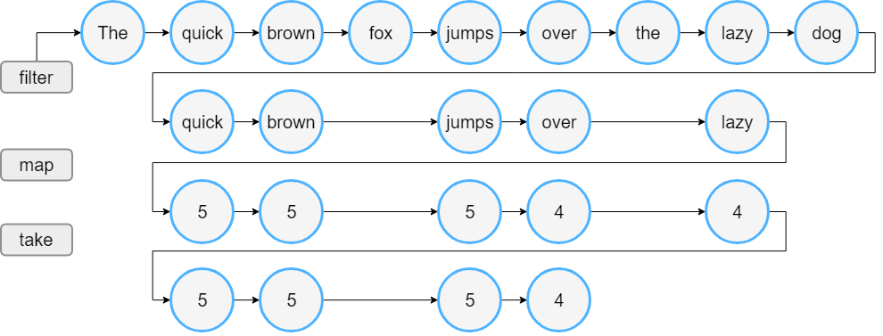
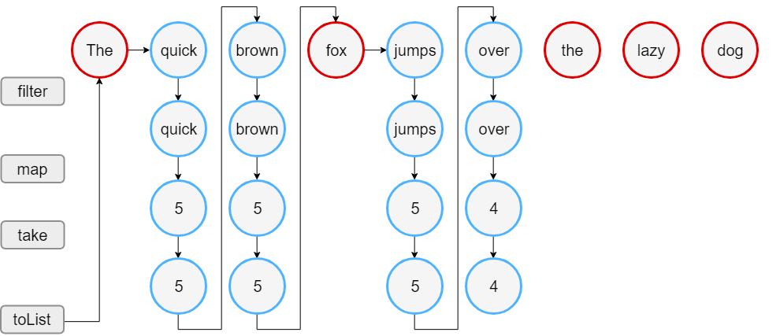
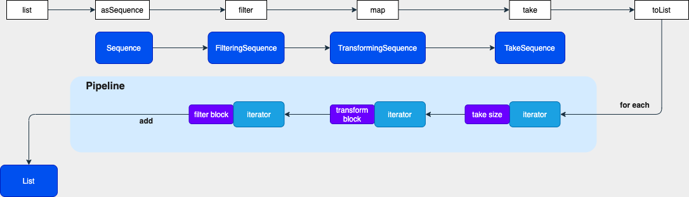

Sequence原理
---

### Sequence 和 List 的区别

以下内容出自[官方示例](https://kotlinlang.org/docs/sequences.html#sequence)

#### 1. List
```kotlin
fun list() {
    val words = "The quick brown fox jumps over the lazy dog".split(" ")
    val wordList = words.toList()
    val lengthList = wordList.filter{ println("filter $it"); it.length > 3}
        .map { println("map ${it.length}"); it.length }
        .take(4)
    println("Lengths of first 4 words longer than 3 chars")
    println(lengthList)
}
```
运行结果如下
```
filter The
filter quick
filter brown
filter fox
filter jumps
filter over
filter the
filter lazy
filter dog
map 5
map 5
map 5
map 4
map 4
Lengths of first 4 words longer than 3 chars
[5, 5, 5, 4]
```
运行过程


#### 2. Sequence

```kotlin
fun sequence() {
    val words = "The quick brown fox jumps over the lazy dog".split(" ")
    val wordSeq = words.asSequence()
    val lengthSeq = wordSeq
        .filter {
            println("filter $it")
            it.length > 3
        }
        .map {
            println("map ${it.length}")
            it.length
        }
        .take(4)

    println("Lengths of first 4 words longer than 3 chars")
    println(lengthSeq.toList())
}
```
运行结果如下
```
Lengths of first 4 words longer than 3 chars
filter The
filter quick
map 5
filter brown
map 5
filter fox
filter jumps
map 5
filter over
map 4
[5, 5, 5, 4]
```
运行过程


#### 3. 区别
1. 直观来看，sequence 执行的步骤少于 list
2. list 的操作符会立即执行，sequence 的操作符可以理解为**先声明**，后面执行 toList 的时候才会触发
3. list filter 操作符处理了全量数据，然后 map 映射 filter 之后的所有数据，sequence 则是每条数据经过 filter -> map 流水线处理，不合格的数据不会向后执行

### Sequence 原理

下面我们具体看看
1. 为什么 sequence 能做到先声明，后触发
2. 为什么 sequence 能实现流水线的效果，避免操作浪费

下面的图描述了，声明操作符到触发流程的过程，我们逐一剖析每一步都做了什么


我们按照代码真正执行的顺序来分析，有助于理解，执行顺序正和我们声明操作的顺序相反

#### take & toList
最后的操作符是 take(4)，然后将其转为了 List。  
首先来看看 take
```kotlin
//take(4) 操作符其实对应的会生成一个 TakeSequence 对象
public fun <T> Sequence<T>.take(n: Int): Sequence<T> {
    require(n >= 0) { "Requested element count $n is less than zero." }
    return when {
        n == 0 -> emptySequence()
        this is DropTakeSequence -> this.take(n)
        else -> TakeSequence(this, n)
    }
}

internal class TakeSequence<T>(
    private val sequence: Sequence<T>, //传入了上一个Sequence，也就是 map 对应的 Sequence
    private val count: Int
) : Sequence<T>, DropTakeSequence<T> {

    init {
        require(count >= 0) { "count must be non-negative, but was $count." }
    }

    override fun drop(n: Int): Sequence<T> = if (n >= count) emptySequence() else SubSequence(sequence, n, count)
    override fun take(n: Int): Sequence<T> = if (n >= count) this else TakeSequence(sequence, n)

    override fun iterator(): Iterator<T> = object : Iterator<T> {
        var left = count
        val iterator = sequence.iterator() //map 对应的 Sequence 的 iterator

        override fun next(): T {
            if (left == 0)
                throw NoSuchElementException()
            left--
            return iterator.next()
        }

        override fun hasNext(): Boolean { //通过 left，决定取 list 中的前几个数据
            return left > 0 && iterator.hasNext() //看上一个 iterator 中是否有数据
        }
    }
}
```
代码中的注释已经详细解释了逻辑，其中重点是：
1. 操作符会对应一个 Sequence 对象去处理迭代逻辑
2. TakeSequence 在构造的时候，传入了上一个 Sequence 对象
3. TakeSequence 的 hasNext 返回什么取决于上一个 iterator 的 hasNext

下面来看看 toList 做了什么
```kotlin
public fun <T> Sequence<T>.toList(): List<T> {
    return this.toMutableList().optimizeReadOnlyList()
}

public fun <T, C : MutableCollection<in T>> Sequence<T>.toCollection(destination: C): C {
    for (item in this) {
        destination.add(item)
    }
    return destination
}
```
optimizeReadOnlyList 只是做了一次类型转换，将 mutable 转为 immutable。
toMutableList 最终会调用到 toCollection，这里面就正式开始了 iterator 的逻辑，也就是走到了 TakeSequence 里面的迭代逻辑。

从 TakeSequence 迭代逻辑里知道，它会继续调用上一个 Sequence 的迭代器逻辑，  
所以，我们大致能猜出，Sequence 是通过类似责任链的方式，完成了流水线操作，我们继续分析。

#### map

```kotlin
public fun <T, R> Sequence<T>.map(transform: (T) -> R): Sequence<R> {
    return TransformingSequence(this, transform)
}

internal class TransformingSequence<T, R>
constructor(
    private val sequence: Sequence<T>, //传入了上一个 Sequence，filter 对应的 Sequence
    private val transformer: (T) -> R) : Sequence<R> {
    override fun iterator(): Iterator<R> = object : Iterator<R> {
        val iterator = sequence.iterator()
        override fun next(): R {
            return transformer(iterator.next())//这里调用我们的 map 逻辑
        }

        override fun hasNext(): Boolean {
            return iterator.hasNext() //调用了上一个 iterator 的 hasNext
        }
    }

    internal fun <E> flatten(iterator: (R) -> Iterator<E>): Sequence<E> {
        return FlatteningSequence<T, R, E>(sequence, transformer, iterator)
    }
}

```
果不其然，map 对应的 Sequence 是 TransformingSequence，并且迭代过程仍然会先调用上一个 Sequence 的 iterator，这基本印证了我们的猜想，继续分析。

#### filter

```kotlin
public fun <T> Sequence<T>.filter(predicate: (T) -> Boolean): Sequence<T> {
    return FilteringSequence(this, true, predicate)
}

internal class FilteringSequence<T>(
    private val sequence: Sequence<T>,//传入上一个 Sequence，asSequence
    private val sendWhen: Boolean = true,
    private val predicate: (T) -> Boolean
) : Sequence<T> {
    override fun iterator(): Iterator<T> = object : Iterator<T> {
        val iterator = sequence.iterator() //上一个 Sequence 的 iterator
        var nextState: Int = -1 
        var nextItem: T? = null

        private fun calcNext() {
            while (iterator.hasNext()) {//上一个 iterator 是否有数据
                val item = iterator.next()
                if (predicate(item) == sendWhen) {//这里调用了我们的过滤逻辑
                    nextItem = item
                    nextState = 1
                    return
                }
            }
            nextState = 0
        }

        override fun next(): T {
            if (nextState == -1)
                calcNext()
            if (nextState == 0)
                throw NoSuchElementException()
            val result = nextItem
            nextItem = null
            nextState = -1
            @Suppress("UNCHECKED_CAST")
            return result as T
        }

        override fun hasNext(): Boolean {
            if (nextState == -1)
                calcNext()
            return nextState == 1
        }
    }
}
```
除了过滤逻辑和 map 不一致，其他是一样的。

#### asSequence

```kotlin
public fun <T> Iterable<T>.asSequence(): Sequence<T> {
    return Sequence { this.iterator() }
}

@kotlin.internal.InlineOnly
public inline fun <T> Sequence(crossinline iterator: () -> Iterator<T>): Sequence<T> = object : Sequence<T> {
    override fun iterator(): Iterator<T> = iterator()
}
```
源码比较简单，就是 new 了一个 Sequence 的匿名对象，并且将 list 的 iterator 作为参数传了进去。  
所以，流水线最后调用的是 list 的 iterator。

#### 总结


再看开始的流程图，回答提出的两个问题

##### 1.为什么 sequence 能做到先声明，后触发

因为操作符并不会触发迭代逻辑，只有最后的 toList 才会真正触发


##### 2.为什么 sequence 能实现流水线的效果，避免操作浪费

因为我们在声明操作符的时候，将 Sequence 对象组装了成了一个链，迭代的时候会从最后一个声明的 iterator 递归地调到第一个声明的 iterator，保证执行顺序是我们声明的顺序。   
并且，如果迭代的某一环不满足条件，就不会继续走到下一个迭代里，也就避免了操作的浪费。


