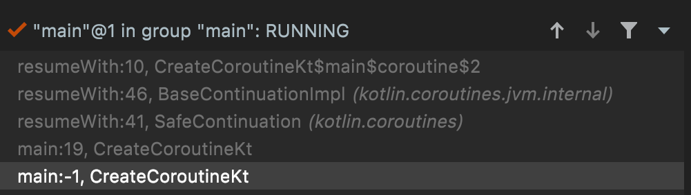
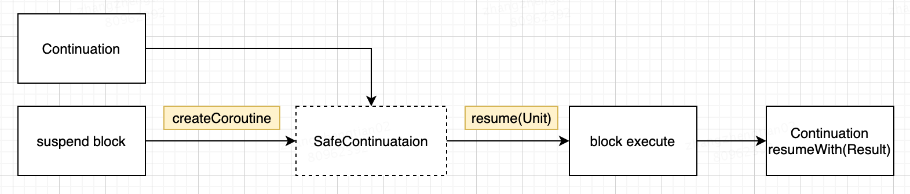
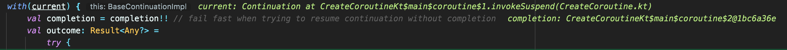

### 创建并启动协程

```kotlin
fun create.main() {
    //1. 创建协程体
    val coroutine = suspend {
        println("in coroutine")
        5
    }.createCoroutine(object: Continuation<Int> {
        override fun resumeWith(result: Result<Int>) {
            println("coroutine end: $result")
        }

        override val context: CoroutineContext
            get() = EmptyCoroutineContext

    })

    //2. 执行协程
    coroutine.resume(Unit)
}
```

**上面代码的输出结果：**
```console
/Library/Java/JavaVirtualMachines/jdk1.8.0_271.jdk/Contents/Home/bin/java -javaagent:/Applications/IntelliJ IDEA CE.app/Contents/lib/idea_rt.jar=63660:/Applications/IntelliJ IDEA CE.app/Contents/bin -Dfile.encoding=UTF-8 -classpath /Library/Java/JavaVirtualMachines/jdk1.8.0_271.jdk/Contents/Home/jre/lib/charsets.jar:/Library/Java/JavaVirtualMachines/jdk1.8.0_271.jdk/Contents/Home/jre/lib/deploy.jar:/Library/Java/JavaVirtualMachines/jdk1.8.0_271.jdk/Contents/Home/jre/lib/ext/cldrdata.jar:/Library/Java/JavaVirtualMachines/jdk1.8.0_271.jdk/Contents/Home/jre/lib/ext/dnsns.jar:/Library/Java/JavaVirtualMachines/jdk1.8.0_271.jdk/Contents/Home/jre/lib/ext/jaccess.jar:/Library/Java/JavaVirtualMachines/jdk1.8.0_271.jdk/Contents/Home/jre/lib/ext/jfxrt.jar:/Library/Java/JavaVirtualMachines/jdk1.8.0_271.jdk/Contents/Home/jre/lib/ext/localedata.jar:/Library/Java/JavaVirtualMachines/jdk1.8.0_271.jdk/Contents/Home/jre/lib/ext/nashorn.jar:/Library/Java/JavaVirtualMachines/jdk1.8.0_271.jdk/Contents/Home/jre/lib/ext/sunec.jar:/Library/Java/JavaVirtualMachines/jdk1.8.0_271.jdk/Contents/Home/jre/lib/ext/sunjce_provider.jar:/Library/Java/JavaVirtualMachines/jdk1.8.0_271.jdk/Contents/Home/jre/lib/ext/sunpkcs11.jar:/Library/Java/JavaVirtualMachines/jdk1.8.0_271.jdk/Contents/Home/jre/lib/ext/zipfs.jar:/Library/Java/JavaVirtualMachines/jdk1.8.0_271.jdk/Contents/Home/jre/lib/javaws.jar:/Library/Java/JavaVirtualMachines/jdk1.8.0_271.jdk/Contents/Home/jre/lib/jce.jar:/Library/Java/JavaVirtualMachines/jdk1.8.0_271.jdk/Contents/Home/jre/lib/jfr.jar:/Library/Java/JavaVirtualMachines/jdk1.8.0_271.jdk/Contents/Home/jre/lib/jfxswt.jar:/Library/Java/JavaVirtualMachines/jdk1.8.0_271.jdk/Contents/Home/jre/lib/jsse.jar:/Library/Java/JavaVirtualMachines/jdk1.8.0_271.jdk/Contents/Home/jre/lib/management-agent.jar:/Library/Java/JavaVirtualMachines/jdk1.8.0_271.jdk/Contents/Home/jre/lib/plugin.jar:/Library/Java/JavaVirtualMachines/jdk1.8.0_271.jdk/Contents/Home/jre/lib/resources.jar:/Library/Java/JavaVirtualMachines/jdk1.8.0_271.jdk/Contents/Home/jre/lib/rt.jar:/Library/Java/JavaVirtualMachines/jdk1.8.0_271.jdk/Contents/Home/lib/ant-javafx.jar:/Library/Java/JavaVirtualMachines/jdk1.8.0_271.jdk/Contents/Home/lib/dt.jar:/Library/Java/JavaVirtualMachines/jdk1.8.0_271.jdk/Contents/Home/lib/javafx-mx.jar:/Library/Java/JavaVirtualMachines/jdk1.8.0_271.jdk/Contents/Home/lib/jconsole.jar:/Library/Java/JavaVirtualMachines/jdk1.8.0_271.jdk/Contents/Home/lib/packager.jar:/Library/Java/JavaVirtualMachines/jdk1.8.0_271.jdk/Contents/Home/lib/sa-jdi.jar:/Library/Java/JavaVirtualMachines/jdk1.8.0_271.jdk/Contents/Home/lib/tools.jar:/Users/zhangzhengtian/IdeaProjects/StartCoroutine/build/classes/kotlin/create.main:/Users/zhangzhengtian/.gradle/caches/modules-2/files-2.1/org.jetbrains.kotlin/kotlin-stdlib/1.5.31/6628d61d0f5603568e72d2d5915d2c034b4f1c55/kotlin-stdlib-1.5.31.jar:/Users/zhangzhengtian/.gradle/caches/modules-2/files-2.1/org.jetbrains/annotations/13.0/919f0dfe192fb4e063e7dacadee7f8bb9a2672a9/annotations-13.0.jar:/Users/zhangzhengtian/.gradle/caches/modules-2/files-2.1/org.jetbrains.kotlin/kotlin-stdlib-common/1.5.31/43331609c7de811fed085e0dfd150874b157c32/kotlin-stdlib-common-1.5.31.jar CreateCoroutineKt
in coroutine
coroutine end: Success(5)
```

### 协程的执行过程



调用栈流程如下



1. 我们通过 suspend block#createCoroutine 得到的 coroutine 实际是 SafeContinuation 对象 
2. SafeContinuation 实际上是代理类，其中的 delegate 属性才是真正的 Continuation 对象 
3. suspend block 中的代码在 BaseContinuationImpl 中执行 
4. 我们的匿名内部类对象 Continuation 被回调

### suspend block 是如何变为协程体被执行的？

我们分析调用栈得知，resumeWith 最终是在 BaseContinuationImpl 中执行的，下面来看看代码

```kotlin
@SinceKotlin("1.3")
internal abstract class BaseContinuationImpl(
    public val completion: Continuation<Any?>?
) : Continuation<Any?>, CoroutineStackFrame, Serializable {
    public final override fun resumeWith(result: Result<Any?>) {
        var current = this
        var param = result
        while (true) {
            probeCoroutineResumed(current)
            with(current) {
                val completion = completion!!
                val outcome: Result<Any?> =
                    try {
                        val outcome = invokeSuspend(param) //1.这里执行了 suspend block
                        if (outcome === COROUTINE_SUSPENDED) return
                        Result.success(outcome)
                    } catch (exception: Throwable) {
                        Result.failure(exception)
                    }
                releaseIntercepted()
                if (completion is BaseContinuationImpl) {
                    current = completion
                    param = outcome
                } else {
                    completion.resumeWith(outcome) //2.这里回调了我们的匿名内部类
                    return
                }
            }
        }
    }

    protected abstract fun invokeSuspend(result: Result<Any?>): Any? //3. 抽象方法
}
```
* 在代码注释 1. 处，调用 current.invokeSuspend，执行了我们定义的协程体，证明 suspend block 其实是 BaseContinuationImpl 的子类 
* 在 2. 处，协程体执行完毕后，我们的代码收到了完成回调 
* 在 3. 处，可以发现 invokeSuspend 是个抽象方法，suspend block 就是这个方法的具体实现

下面我通过断点，进一步分析 suspend block 是通过哪个子类执行的。



可以看到 current 是名为 {文件}${方法}${变量}$1 格式的对象，证明 kotlin 编译器遇到 suspend 关键字后会帮我们生成一个 BaseContinuationImpl 的子类

那么，这个子类到底是什么呢？将 kt 编译为 .class 再通过 jadx 打开后，得到的 java 代码如下

```java
public final class CreateCoroutineKt {
    public static final void create.main() {
        Continuation coroutine = ContinuationKt.createCoroutine(new CreateCoroutineKt$create.main$coroutine$1(null), new CreateCoroutineKt$create.main$coroutine$2());
        Unit unit = Unit.INSTANCE;
        Result.Companion companion = Result.Companion;
        coroutine.resumeWith(Result.constructor-impl(unit));
    }
}
```

```java
final class CreateCoroutineKt$create.main$coroutine$1 extends SuspendLambda implements Function1<Continuation<? super Integer>, Object> {
    int label;

    CreateCoroutineKt$create.main$coroutine$1(Continuation<? super CreateCoroutineKt$create.main$coroutine$1> continuation) {
        super(1, continuation);
    }

    @NotNull
    public final Continuation<Unit> create(@NotNull Continuation<?> continuation) {
        return new CreateCoroutineKt$create.main$coroutine$1(continuation);
    }

    @Nullable
    public final Object invoke(@Nullable Continuation<? super Integer> continuation) {
        return create(continuation).invokeSuspend(Unit.INSTANCE);
    }

    @Nullable
    public final Object invokeSuspend(@NotNull Object obj) {
        IntrinsicsKt.getCOROUTINE_SUSPENDED();
        switch (this.label) {
            case 0:
                ResultKt.throwOnFailure(obj);
                System.out.println((Object) "in coroutine"); //协程体的逻辑
                return Boxing.boxInt(5);
            default:
                throw new IllegalStateException("call to 'resume' before 'invoke' with coroutine");
        }
    }
}
```

明显看出，kt 编译器帮助我们把 suspend 关键字变为了 SuspendLambda 的 子类，并重写了 invokeSuspend 方法，不难猜出 SuspendLambda 继承自 BaseContinuationImp